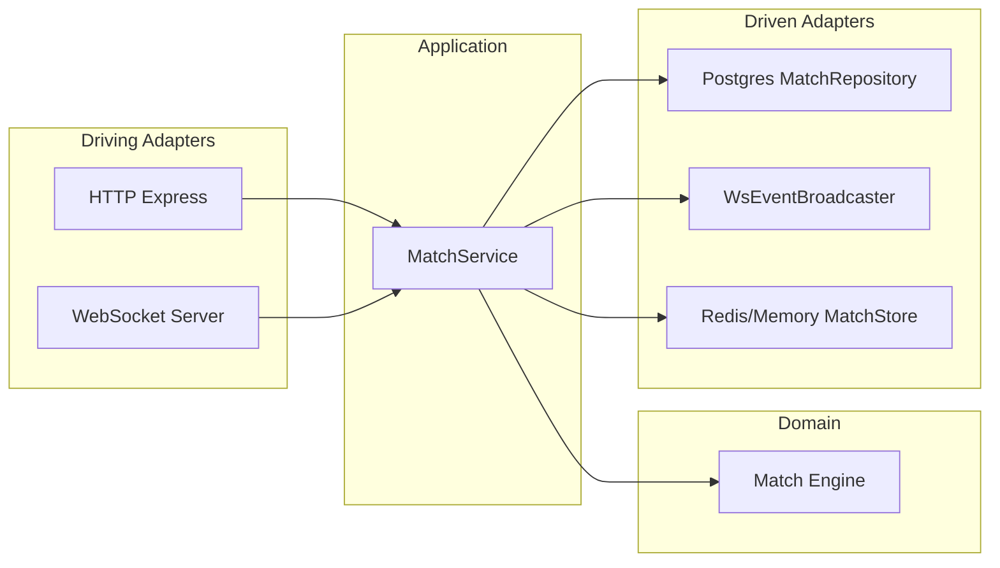

# Backend Architecture — Detonadores (US-001)

Technical stack and module boundaries for the backend. The match engine is authoritative and implemented as pure TypeScript with no renderer or transport dependencies.

**Frontend renderer (project decision):** Phaser (recommended in project vision). Documented at project level; implementation is frontend scope.

---

## 1. Technical stack

| Layer | Technology |
|-------|------------|
| Runtime | Node.js |
| Language | TypeScript |
| HTTP API | Express |
| WebSocket | `ws` (or equivalent) |
| Database (durable) | Postgres (Neon) |
| Live state / cache | Redis |
| Run / dev | `tsx` or `ts-node` |
| Test | Vitest or Jest |

---

## 2. Module boundaries (Hexagonal)

- **Core (domain):** Match engine and domain types. Pure TypeScript; no imports from Express, WebSocket, Postgres, or Redis. Owns grid, players, bombs, explosions, and the tick loop (target ~20Hz).
- **Ports:** Interfaces the core/application need from the outside (e.g. `MatchRepository`, `EventBroadcaster`, `MatchStore`). Defined in a dedicated ports layer.
- **Driving adapters (primary):** HTTP (Express routes for auth, dashboard, rooms), WebSocket server (receives client events, calls into application/match engine).
- **Driven adapters (secondary):** Postgres (implements `MatchRepository`), Redis (implements `MatchStore` for live match state), WebSocket broadcaster (implements `EventBroadcaster`; sends snapshots/events to clients).

---

## 3. Responsibilities

| Component | Responsibility |
|-----------|----------------|
| **Client** (out of scope for backend) | UI rendering, input capture, WebSocket client, interpolation. |
| **Match engine** | Authoritative simulation; input queue; tick loop (~20Hz); produces snapshots/events. No I/O. Inputs are queued and resolved by the engine, not by the client view. |
| **WebSocket adapter** | Translates client events to engine/application calls; subscribes to engine output; sends `match:snapshot`, `match:event`, `match:ended`. |
| **Persistence layer** | Postgres adapters for durable data: users, sessions, rooms, room_players, matches, match_players. |
| **Redis** | Live match state (e.g. current match id per room, session-to-match mapping for reconnect); may be complemented by in-process memory for single-server MVP. |

---

## 4. Data placement

| Storage | Data | When |
|---------|------|------|
| **Postgres** | `users`, `sessions`, `rooms`, `room_players`, `matches`, `match_players` | Persisted after match end and room lifecycle. Source of truth for durable records. |
| **Memory / Redis** | Live match state (grid, players, bombs, timers); room presence; reconnect reservation | During active match. Postgres is **not** the source of truth for in-progress match simulation. |

During an active match, the authoritative state lives in memory (and optionally Redis for multi-instance/reconnect). Postgres is written when a match ends or when room/lobby data is committed.

---

## 5. Match simulation tick loop

The match simulation tick loop runs at **about 20Hz** (target ~50ms per tick). The engine exposes `tick()` and does not run timers; the application layer (or adapter) runs a ~20Hz loop that calls `tick()` when a match is active and then broadcasts the snapshot. The tick interval constant is defined in code (e.g. `TICK_INTERVAL_MS`) so 20Hz is explicit and changeable in one place.

**Match lifecycle states:** The engine supports `waiting`, `starting`, `active`, and `ended`. A match starts only when at least two players are present; the first tick after start transitions `starting` to `active`. When one or zero players remain alive, the engine sets status to `ended` and stores `winnerId` (exposed in every snapshot after end). The application broadcasts `match:ended` with `winnerId` when the match finishes.

**Explosion propagation:** Explosions spread in a cross (four cardinal directions) from the bomb origin up to the bomb’s range. Hard blocks stop propagation; soft blocks are destroyed (tile becomes floor) and stop propagation at that tile. Players on explosion tiles take damage once per explosion wave: if the player has an active shield (`shieldActive`), the shield is consumed and the player survives; otherwise the player is marked dead. The shield effect is intended to be set by powerups (e.g. US-013).

**Chain reactions and bomb capacity:** A player may have multiple bombs on the grid; placement is allowed whenever they have remaining capacity (`player.bombs > 0`). When a bomb explodes (timer or chain), its owner receives one bomb slot back. An explosion can trigger another bomb before its timer completes (chain reaction); each bomb is resolved at most once per tick.

**Powerup spawn:** When a soft block is destroyed by an explosion, a powerup spawns on that tile with a fixed probability P (e.g. 50%, see `POWERUP_SPAWN_CHANCE` in `powerupConstants.ts`). The powerup type is chosen uniformly at random from the five MVP types: bomb_capacity, flame_range, speed, shield, special. Powerups are stored in the snapshot (`powerups` array) and remain on the tile until picked up (US-013) or removed by other game rules. The RNG used is unspecified in production (e.g. `Math.random()`).

**Powerup pickup:** When a player ends movement on a tile that contains a powerup (i.e. an entry in the engine’s `powerups` at that (x, y)), the powerup is removed and its effect is applied immediately in the same tick.

**Powerup effects:**  
- **bomb_capacity:** +1 to the player’s placeable bomb count.  
- **flame_range:** +1 to the player’s explosion range (used when they place a bomb).  
- **speed:** +1 movement step per directional input; capped at **MAX_SPEED** (e.g. 3). See speed cap below.  
- **shield:** Sets `shieldActive: true`. The next time the player would be killed by an explosion, the shield is consumed and the player survives (one valid death event prevented).  
- **special (MVP):** Same effect as Shield (grants one death prevention). Full utility TBD post-MVP.

**Speed cap:** Movement allows up to `speed` tiles per directional input (default 1; `DEFAULT_SPEED` / `MAX_SPEED` in `powerupConstants.ts`). Speed is clamped to [1, MAX_SPEED] when applying the speed powerup.

**Shield rule:** One valid death event prevented; shield is consumed on first explosion hit (logic already in explosion effects).

**Sudden death:** After a documented time threshold (tick count ≥ `SUDDEN_DEATH_START_TICK`, e.g. 3600 ≈ 3 min at 20 Hz, see `suddenDeathConstants.ts`), the map collapses from the outer ring inward. Collapse order is deterministic (Chebyshev distance from center, descending; within ring, sorted by (y, x)). One tile collapses per tick.

**Collapse rule:** When a tile collapses, any player on that tile is killed; any bomb on that tile is removed and its owner refunded one bomb; any powerup on that tile is removed. Collapse continues until the match has a winner (existing win condition). Collapsed tiles are non-walkable and block explosion propagation.

---

## 6. WebSocket message contract

WebSocket message contract (event types, payloads, error codes): see **`docs/websocket-contract.md`** at project root. Backend protocol types and parser live in `src/protocol/`; the WebSocket adapter uses them to parse incoming messages and send only the defined server event shapes.
